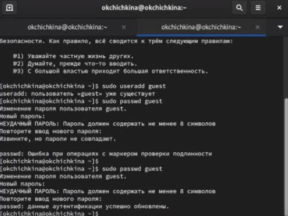
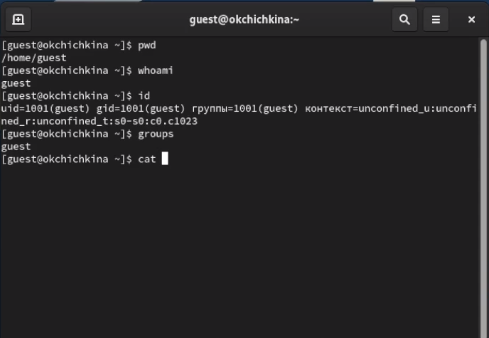
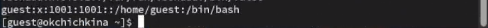
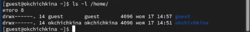
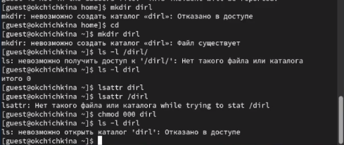

---
## Front matter
lang: ru-RU
title: Лабораторная работа 2
author:
  - Чичкина Ольга, 1032217621
institute:
  - Российский университет дружбы народов, Москва, Россия
date: "2024 год"

## i18n babel
babel-lang: russian
babel-otherlangs: english

## Formatting pdf
toc: false
toc-title: Содержание
slide_level: 2
aspectratio: 169
section-titles: true
theme: metropolis
header-includes:
 - \metroset{progressbar=frametitle,sectionpage=progressbar,numbering=fraction}
---

# Цель работы

Получение практических навыков работы в консоли с атрибутами файлов, закрепление теоретических основ дискреционного разграничения доступа в современных системах с открытым кодом на базе ОС Linux.

# Задание

Постарайтесь последовательно выполнить все пункты, занося ваши ответы на поставленные вопросы и замечания в отчёт.

# Выполнение лабораторной работы

Сначала нужно создать нового пользователя по имени `guest`, задать его пароль и зайти в систему от его имени (рис. [-@fig:001]).

{#fig:001 width=70%}

Этот пользователь оказался в папке `/home/guest` -- по умолчанию домашняя папка пользователя `/home/<имя_пользователя>`. Эта папка выглядит не так в приглашении командной строки --
там, домашняя папка пользователя сокращается до `~`.

После этого мы выясняем информацию про самого этого пользователя (рис. [-@fig:002]).

{#fig:002 width=70%}

В выводе этой команды видно, что имя пользователя равно `guest` -- это соответствует первой части приглашения командной строки, до символа `@`.
С помощью команды `id` мы узнали, что этот пользователь имеет UID `1001` и GID `1001`, а также принадлежит к единственной группе с UID `1001` -- `guest` (об этом также сообщает команда `groups`).

Эту же информацию можно определить, посмотрев в системную базу данных пользователей -- `/etc/passwd` (рис. [-@fig:003]).

{#fig:003 width=70%}

Здесь видно, что пользователь `guest` имеет пароль `x` (то есть, он хранится в `/etc/shadow`), UID `1001` и GID `1001`, не имеет полного имени пользователя, имеет домашнюю директорию `/home/guest` и интерпретатор `/bin/bash`.

Попытавшись посмотреть на информацию о папке `/home`, мы видим результат на рис. [-@fig:004].

{#fig:004 width=70%}

Базовая информация о папках в `/home` доступна: мы видим домашнюю папку для `dmgeneralov` и для `guest`, и они обе имеют права, которые разрешают владельцу все действия, а остальным -- никакие.
В частности, остальные пользователи не могут выполнять `lsattr` на них, потому что происходит ошибка разрешений при чтении этой информации про `/home/dmgeneralov`, но эта информация (пустая) возвращается для `guest`.

Затем мы создаем папку, настраиваем разрешения для нее, и пытаемся использовать ее (рис. [-@fig:005]).

{#fig:005 width=70%}

Сначала папка имеет права для чтения-записи для владельца, и только чтения для остальных, и мы можем использовать ее (в том числе читать `lsattr`). После этого мы меняем разрешения с помощью `chmod`, так что никто не имеет никаких прав на доступ к ней. Как результат, мы не можем создать файл в этой папке, и он действительно не создается (что можно подтвердить, посмотрев на эту папку от пользователя `root`).

В выводе команды `ls -l` в начале пишется шифр, который обозначает права на этот файл или папку. В случае папок, этот шифр имеет следующий смысл:

Права директории | Права файла | Создание файла | Удаление файла | Запись в файл | Чтение файла | Смена директории | Просмотр файлов в директории | Переименование файла | Смена атрибутов файла
---|---|---|---|---|---|---|---|---|---
d--------- (000) | ---------- (000) | - | - | - | - | - | - | - | -
d--x------ (100) | ---x------ (100) | - | - | - | - | + | - | - | +
d-w------- (200) | --w------- (200) | - | - | + | - | - | - | - | -
d-wx------ (300) | --wx------ (300) | + | + | + | - | + | - | + | +
dr-------- (400) | -r-------- (400) | - | - | - | + | - | - | - | -
dr-x------ (500) | -r-x------ (500) | - | - | - | + | + | + | - | -
drw------- (600) | -rw------- (600) | - | - | + | + | - | - | - | -
drwx------ (700) | -rwx------ (700) | + | + | + | + | + | + | + | +

На основании этих данных можно определить минимальные права, которые нужно поставить на файл или папку, если мы хотим разрешить кому-то делать определенные операции с ними:

Операция | Права на директорию | Права на файл
---|---|---
Создание файла         | -wx | ???
Удаление файла         | -wx | ---
Чтение файла           | --x | r--
Запись в файл          | --x | -w-
Переименование файла   | -wx | ---
Создание поддиректории | -wx | ???
Удаление поддиректории | -wx | ???

# Выводы

Мы изучили, как использовать базовый дискреционный контроль доступа в Linux,
и определили, какие аттрибуты позволяют выполнять какие действия над папками или файлами.
