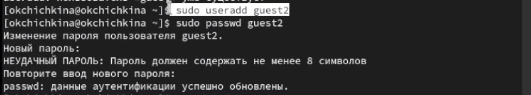
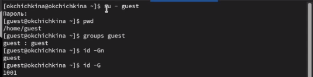
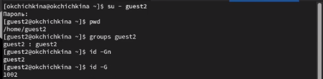

---
## Front matter
title: "Лабораторная работа 3"
author: "Чичкина Ольга, 1032217621"

## Generic otions
lang: ru-RU
toc-title: "Содержание"

## Bibliography
bibliography: bib/cite.bib
csl: pandoc/csl/gost-r-7-0-5-2008-numeric.csl

## Pdf output format
toc: true # Table of contents
toc-depth: 2
lof: true # List of figures
lot: true # List of tables
fontsize: 12pt
linestretch: 1.5
papersize: a4
documentclass: scrreprt
## I18n polyglossia
polyglossia-lang:
  name: russian
  options:
	- spelling=modern
	- babelshorthands=true
polyglossia-otherlangs:
  name: english
## I18n babel
babel-lang: russian
babel-otherlangs: english
## Fonts
mainfont: IBM Plex Serif
romanfont: IBM Plex Serif
sansfont: IBM Plex Sans
monofont: IBM Plex Mono
mathfont: STIX Two Math
mainfontoptions: Ligatures=Common,Ligatures=TeX,Scale=0.94
romanfontoptions: Ligatures=Common,Ligatures=TeX,Scale=0.94
sansfontoptions: Ligatures=Common,Ligatures=TeX,Scale=MatchLowercase,Scale=0.94
monofontoptions: Scale=MatchLowercase,Scale=0.94,FakeStretch=0.9
mathfontoptions:
## Biblatex
biblatex: true
biblio-style: "gost-numeric"
biblatexoptions:
  - parentracker=true
  - backend=biber
  - hyperref=auto
  - language=auto
  - autolang=other*
  - citestyle=gost-numeric
## Pandoc-crossref LaTeX customization
figureTitle: "Рис."
tableTitle: "Таблица"
listingTitle: "Листинг"
lofTitle: "Список иллюстраций"
lotTitle: "Список таблиц"
lolTitle: "Листинги"
## Misc options
indent: true
header-includes:
  - \usepackage{indentfirst}
  - \usepackage{float} # keep figures where there are in the text
  - \floatplacement{figure}{H} # keep figures where there are in the text
---

# Цель работы

Получение практических навыков работы в консоли с атрибутами файлов для групп пользователей.

# Выполнение лабораторной работы

Мы продолжаем выполнение с того места, где мы остановились в лабораторной работе 2:
теперь, чтобы проверить, как работает контроль доступа в Linux с двумя пользователями,
надо создать второго пользователя и зайти в систему от его имени.
Мы видим, что пользователь guest находится в папке `/home/guest`,
а пользователь guest2 -- в папке `/home/guest2`,
но они оба имеют приглашение, которое говорит им, что они находятся в `~` --
это сокращение указывает на домашнюю папку текущего пользователя. (рис. [-@fig:001]).

{#fig:001 width=70%}

Команды `groups` и `id` дают нам одинаковую информацию:
пользователь `guest` принадлежит только группе `guest` (GID=1001),
а пользователь `guest2` -- группе `guest2` (GID=1002), а также группе `guest`.
В файле `/etc/groups` написана только вторая связь, потому что основной GID пользователя хранится в `/etc/passwd` (рис. [-@fig:002], рис. [-@fig:003]).

{#fig:002 width=70%}
{#fig:003 width=70%}

После этого мы меняем активную группу пользователя `guest2` с помощью команды `newgrp`,
а затем запрещаем все операции над папкой `/home/guest/dir1`. Это можно подтвердить,
потому что в выводе `ls -l` для этой папки стоят все прочерки в битах разрешения (рис. [-@fig:004], рис. [-@fig:005]).

{#fig:004 width=70%}
{#fig:005 width=70%}
На основании этого можно заполнить таблицу разрешений:

Права директории | Права файла | Создание файла | Удаление файла | Запись в файл | Чтение файла | Смена директории | Просмотр файлов в директории | Переименование файла | Смена атрибутов файла
---|---|---|---|---|---|---|---|---|---
d (000) | (000)        | - | - | - | - | - | - | - | -
d-x (100) | -x(100)    | - | - | - | - | + | - | - | -
d-w (200) | -w(200)    | + | - | - | - | - | - | - | -
d-wx (300) | -wx(300)  | + | + | + | - | + | - | + | +
dr (400) | r(400)      | - | - | - | + | - | - | - | -
dr-x (500) | r-x(500)  | - | - | - | + | + | + | - | -
drw (600) | rw(600)    | - | - | + | + | - | - | - | -
drwx (700) | rwx(700)  | + | + | + | + | + | + | + | +

На основании этого можно вывести таблицу минимальных прав, которые необходимы для каждой операции:

Операция | Минимальные права на директорию | Минимальные права на файл
---|---|---
Создание файла | -wx | ???
Удаление файла | -wx | ---
Чтение файла | --x | r--
Запись в файл | --x | -w-
Переименование файла | -wx | ---
Создание поддиректории | -wx | ???
Удаление поддиректории | -wx | ---

# Выводы

Мы изучили, как использовать базовый дискреционный контроль доступа в Linux,
и определили, какие аттрибуты позволяют выполнять какие действия над папками или файлами.
Мы также проверили, что эти свойства сохраняются при ситуации с несколькими пользователями.
