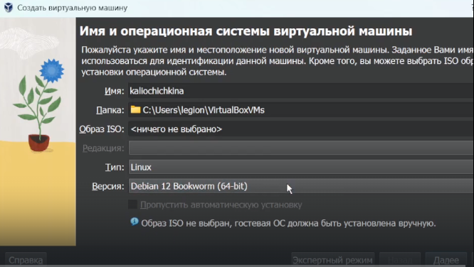
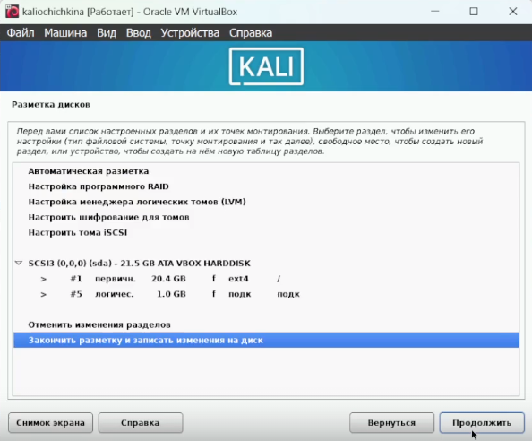
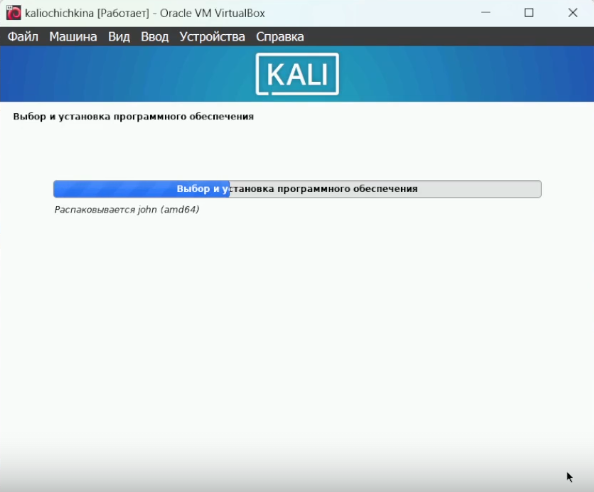

---
## Front matter
title: "Индивидуальный проект 1"
author: "Чичкина Ольга, 1032217621"

## Generic otions
lang: ru-RU
toc-title: "Содержание"

## Bibliography
bibliography: bib/cite.bib
csl: pandoc/csl/gost-r-7-0-5-2008-numeric.csl

## Pdf output format
toc: true # Table of contents
toc-depth: 2
lof: true # List of figures
lot: true # List of tables
fontsize: 12pt
linestretch: 1.5
papersize: a4
documentclass: scrreprt
## I18n polyglossia
polyglossia-lang:
  name: russian
  options:
	- spelling=modern
	- babelshorthands=true
polyglossia-otherlangs:
  name: english
## I18n babel
babel-lang: russian
babel-otherlangs: english
## Fonts
mainfont: IBM Plex Serif
romanfont: IBM Plex Serif
sansfont: IBM Plex Sans
monofont: IBM Plex Mono
mathfont: STIX Two Math
mainfontoptions: Ligatures=Common,Ligatures=TeX,Scale=0.94
romanfontoptions: Ligatures=Common,Ligatures=TeX,Scale=0.94
sansfontoptions: Ligatures=Common,Ligatures=TeX,Scale=MatchLowercase,Scale=0.94
monofontoptions: Scale=MatchLowercase,Scale=0.94,FakeStretch=0.9
mathfontoptions:
## Biblatex
biblatex: true
biblio-style: "gost-numeric"
biblatexoptions:
  - parentracker=true
  - backend=biber
  - hyperref=auto
  - language=auto
  - autolang=other*
  - citestyle=gost-numeric
## Pandoc-crossref LaTeX customization
figureTitle: "Рис."
tableTitle: "Таблица"
listingTitle: "Листинг"
lofTitle: "Список иллюстраций"
lotTitle: "Список таблиц"
lolTitle: "Листинги"
## Misc options
indent: true
header-includes:
  - \usepackage{indentfirst}
  - \usepackage{float} # keep figures where there are in the text
  - \floatplacement{figure}{H} # keep figures where there are in the text
---

# Цель работы

В этом этапе индивидуального проекта требуется установить Kali Linux на виртуальную машину,
чтобы использовать в последующих этапах индивидуального проекта.

# Выполнение лабораторной работы

Сначала мы должны перейти на официальный сайт Kali Linux и загрузить ISO установщика 

После этого мы запускаем менеджер виртуальных машин и создаем там новую виртуальную машину.
Мы уже делали это при установке Rocky Linux для лабораторных работ,
поэтому здесь можно лишь отметить, что мы используем стандартные настройки для Debian 12, потому что они подходят для Kali Linux (рис. [-@fig:001]).

{#fig:001 width=70%}

После этого виртуальная машина запускается с того ISO-файла, который мы указали.
Отсюда мы настраиваем все параметры установки (рис. [-@fig:002]).

{#fig:002 width=70%}

Наконец, после установки мы перезагружаемся и входим в систему (рис. [-@fig:003]).

{#fig:003 width=70%}

# Выводы

Мы успешно установили Kali Linux на виртуальную машину для подготовки к следующим этапам индивидуального проекта.

