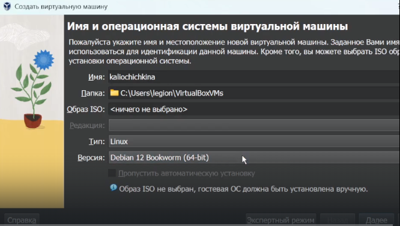
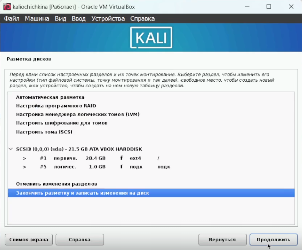
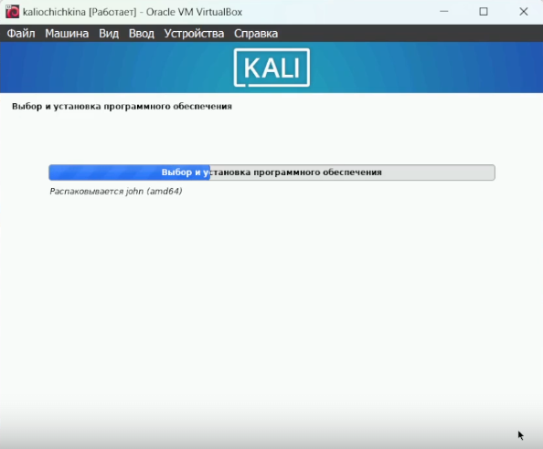

---
## Front matter
lang: ru-RU
title: Индивидуальный проект 1
author:
  - Чичкина Ольга, 1032217621
institute:
  - Российский университет дружбы народов, Москва, Россия
date: "2024 год"

## i18n babel
babel-lang: russian
babel-otherlangs: english

## Formatting pdf
toc: false
toc-title: Содержание
slide_level: 2
aspectratio: 169
section-titles: true
theme: metropolis
header-includes:
 - \metroset{progressbar=frametitle,sectionpage=progressbar,numbering=fraction}
---

# Цель работы

В этом этапе индивидуального проекта требуется установить Kali Linux на виртуальную машину,
чтобы использовать в последующих этапах индивидуального проекта.

# Выполнение лабораторной работы

Сначала мы должны перейти на официальный сайт Kali Linux и загрузить ISO установщика 

После этого мы запускаем менеджер виртуальных машин и создаем там новую виртуальную машину.
Мы уже делали это при установке Rocky Linux для лабораторных работ,
поэтому здесь можно лишь отметить, что мы используем стандартные настройки для Debian 12, потому что они подходят для Kali Linux (рис. [-@fig:001]).

{#fig:001 width=70%}

После этого виртуальная машина запускается с того ISO-файла, который мы указали.
Отсюда мы настраиваем все параметры установки (рис. [-@fig:002]).

{#fig:002 width=70%}

Наконец, после установки мы перезагружаемся и входим в систему (рис. [-@fig:003]).

{#fig:003 width=70%}

# Выводы

Мы успешно установили Kali Linux на виртуальную машину для подготовки к следующим этапам индивидуального проекта.

